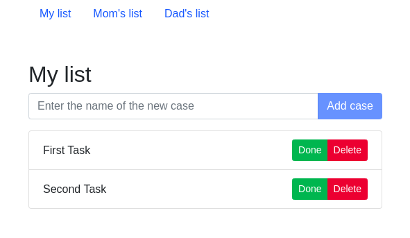

# todo-app-js

> Simple to-do app with vanilla JS and Bootstrap.
>
> Live demo [_here_](https://sashauly.github.io/todo-app-js/)
>
## Table of Contents
- [todo-app-js](#todo-app-js)
  - [Table of Contents](#table-of-contents)
  - [General Information](#general-information)
  - [Technologies Used](#technologies-used)
  - [Features](#features)
  - [Setup](#setup)
  - [Project status](#project-status)
  - [Contacts](#contacts)

## General Information
- This is a simple educational project to get familiar with DOM elements. So basically all the logic happens in *JS* with some simple setup in *HTML*.
- In order to focus entirely on *DOM elements*, the **Bootstrap** library is used instead of custom *CSS*
- **localStorage** is used to save a list of notes

## Technologies Used
- JavaScript ES6
- [Bootstrap](https://getbootstrap.com/)
- HTML5
- localStorage

## Features
List the ready features here:
- Ability to add and delete notes
- Ability to mark a note as done
- Custom list for 3 different people
- Notes are stored in **localStorage** for reuse after page/browser reload

## Setup
Just open [the live version](https://sashauly.github.io/todo-app-js/). For now this project served for presentation purposes

## Project status

Project is: _complete_
## Contacts

Created by [@sashauly](https://t.me/sashauly) - feel free to contact me!